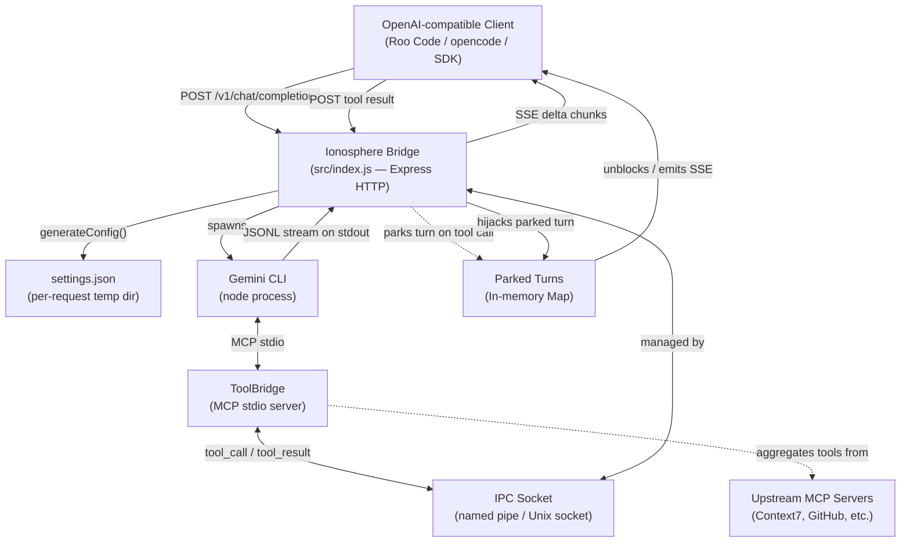
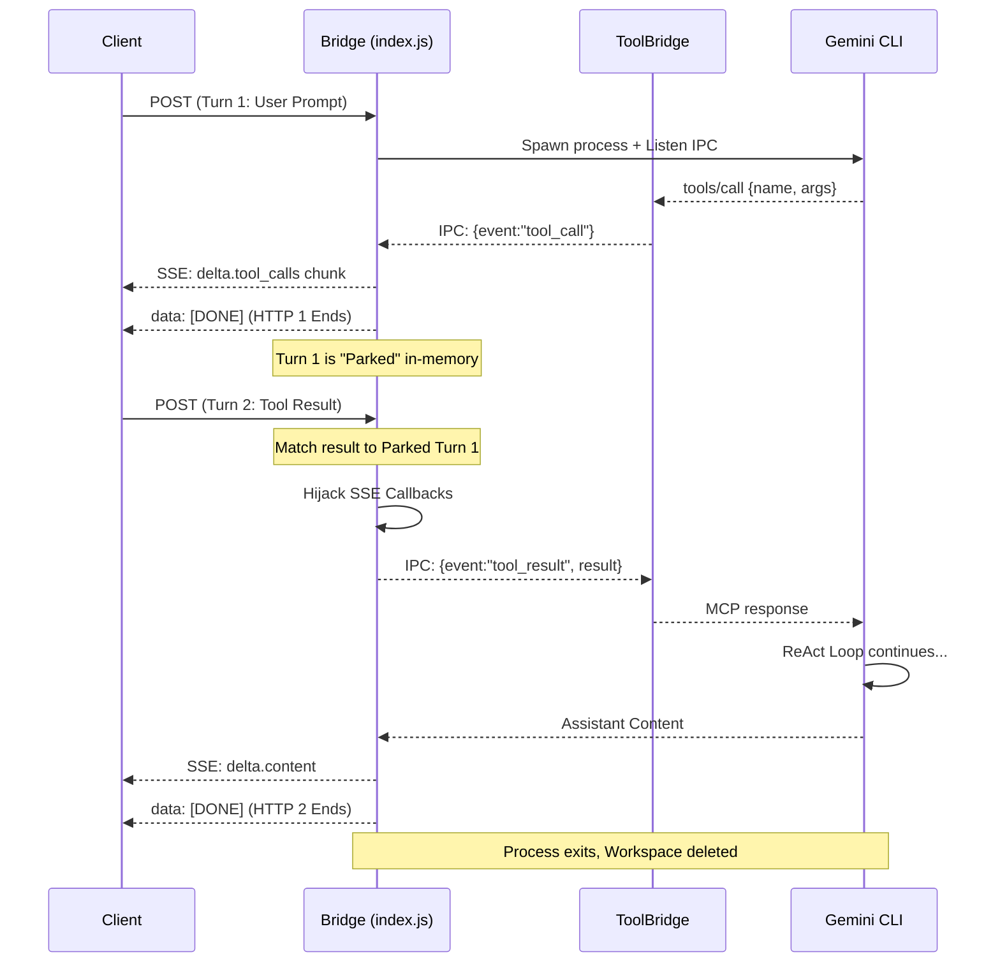

# Ionosphere Architecture

Ionosphere is a **strictly stateless** HTTP bridge that translates OpenAI-compatible API requests into Gemini CLI invocations. It implements a "Warm Stateless Handoff" strategy to maintain high-performance ReAct loops without persistent server-side state.

---

## System Overview



---

## The "Warm Stateless Handoff" Strategy

Ionosphere prioritizes both **Privacy** (no persistent state) and **Performance** (agentic efficiency). 

### How it works:
1. **Request 1 (Prompt)**: The bridge spawns a Gemini CLI process. The CLI sends a `tool_call` over IPC.
2. **Parking**: Instead of killing the CLI, the bridge "parks" the turn in memory and ends the HTTP response for Request 1.
3. **Request 2 (Result)**: When the client returns the tool result, the bridge finds the "parked" turn, hijacks its output stream (updating the SSE callbacks), and writes the result back into the CLI via IPC.
4. **Cleanup**: The turn workspace is only deleted after the CLI process finally exits (on final answer or error).

This allows the Gemini CLI to keep its internal context "warm" during a tool loop without ever writing that context to a database.

---

## Request Lifecycle



---

## Prompt Serialization

The bridge converts the OpenAI `messages` array into a plain-text prompt string. Since Ionosphere is strictly stateless, the client sends the entire conversation history every request.

### Message Role Mapping

| OpenAI Role | Serialized Format |
|---|---|
| `system` | Extracted to system prompt parameter |
| `user` | `USER: <text>` |
| `assistant` (text only) | `ASSISTANT: <text>` |
| `assistant` (with tool_calls) | `ASSISTANT: <text>\n[ACTION: Called tool '<name>' with args: <json>]` |
| `tool` / `function` | `[TOOL RESULT (<tool_call_id>)]:\n<content>` |

---

## Temporary Workspace Isolation

Each turn gets a fully isolated workspace in `temp/`.

```
temp/
└── {turnId-uuid}/              ← created on request arrival
    ├── .gemini/
    │   └── settings.json       ← per-request CLI configuration
    ├── image_1.png             ← decoded base64 images
    ├── tools.json              ← OpenAI tool definitions
    └── tool_ipc.sock           ← Unix socket for ToolBridge IPC
```

- **GC**: A sweeper deletes directories older than 15 minutes that are NOT currently parked.
- **Cleanup**: Workspace is deleted immediately when the CLI process ends.

---

## Environment Variables Reference

| Variable | Default | Description |
|---|---|---|
| `PORT` | `3000` | HTTP server port |
| `API_KEY` | *(none)* | Bearer token validation |
| `GEMINI_CLI_PATH` | `gemini` | Path/command to invoke the Gemini CLI |
| `GEMINI_MODEL` | `gemini-2.5-flash-lite` | Default model |
| `MAX_CONCURRENT_CLI` | `5` | Max simultaneous CLI processes |

---

## Available Models

Any of the following model identifiers can be passed in the `model` field of the API request:

- `auto-gemini-3` (Auto-selecting Gemini 3)
- `auto-gemini-2.5` (Auto-selecting Gemini 2.5)
- `gemini-3-pro-preview`
- `gemini-3-flash-preview`
- `gemini-2.5-flash`
- `gemini-2.5-pro`
- `gemini-2.5-flash-lite` (Default)

---

## Security Model

- **No Persistent State**: Eliminates the risk of database leaks or long-term data exposure.
- **Ephemeral Workspaces**: All turn data is short-lived in-memory or in temporary directories.
- **Input Sanitization**: `@` and `!` prefixes are escaped to prevent user content from triggering CLI directives.
- **Dumb CLI**: CLI filesystem/shell tools are disabled by default. All interactions flow through the client.

---

## Repository Structure

```
gemini-ionosphere/
├── src/
│   ├── index.js              ← HTTP server & Handoff Orchestrator
│   └── GeminiController.js   ← CLI lifecycle & Stream Hijacking
├── packages/
│   └── tool-bridge/          ← MCP Aggregator (ToolBridge)
├── scripts/
│   └── generate_settings.js  ← Per-turn settings generator
└── temp/                     ← Ephemeral turn workspaces
```

---

### Transparent Native Tools
To provide a seamless experience for internal CLI features (like `google_web_search`), Ionosphere supports a **Transparent Whitelist**. When the CLI emits a `tool_use` event for a whitelisted tool:
1. The bridge logs the execution but **skips** the `onToolCall` callback.
2. The HTTP request remains open and the SSE stream continues.
3. Once the CLI finishes its internal tool loop, it emits more `message` chunks which are sent to the client as usual.

This allows the client to see a search-augmented response without managing the intermediate tool step.
