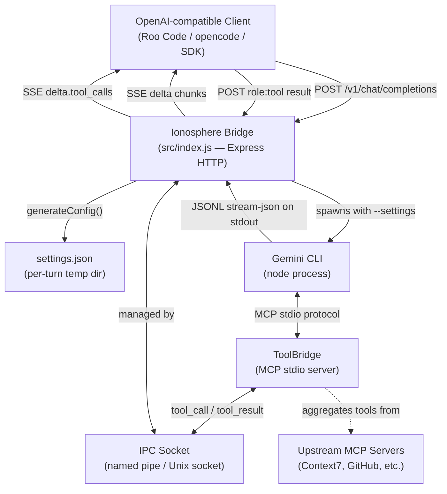
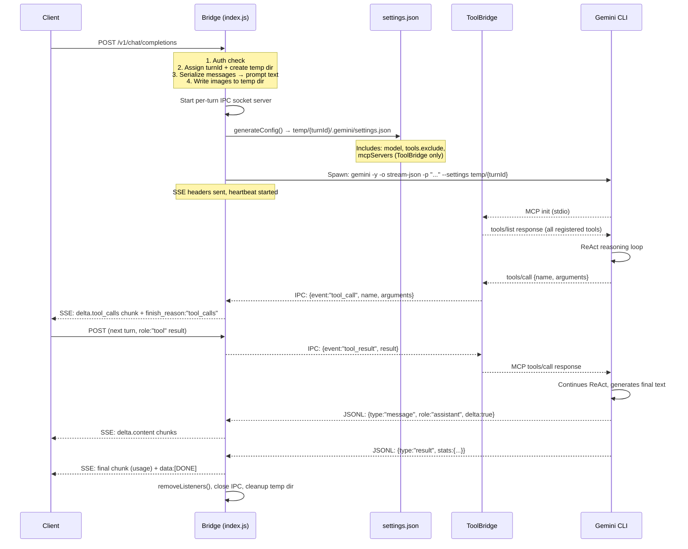
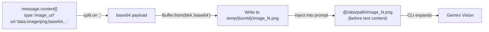
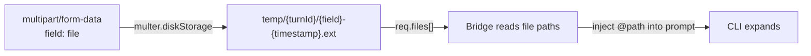
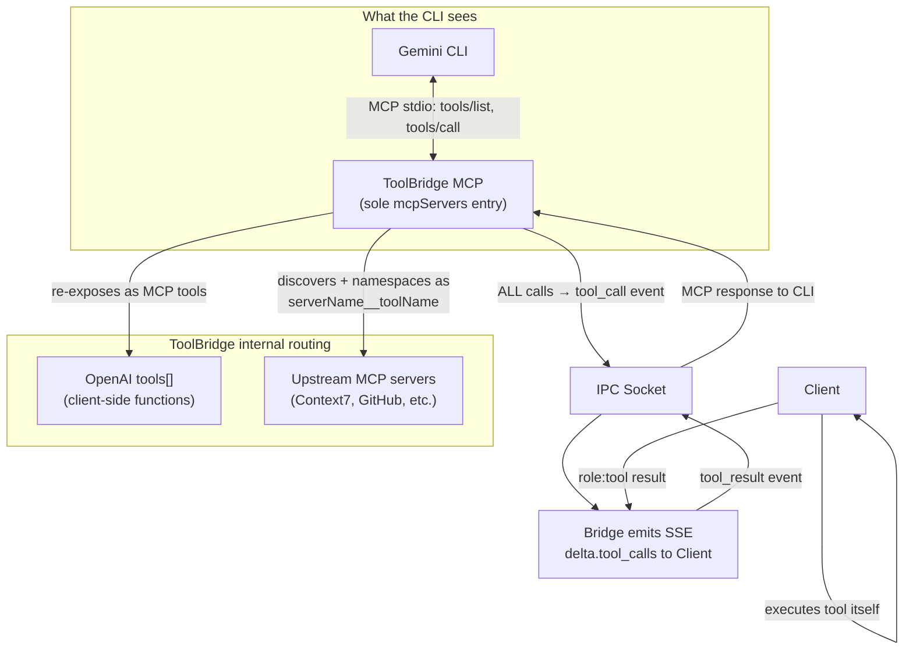
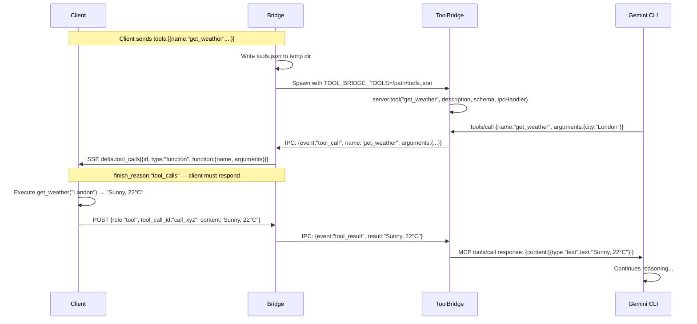
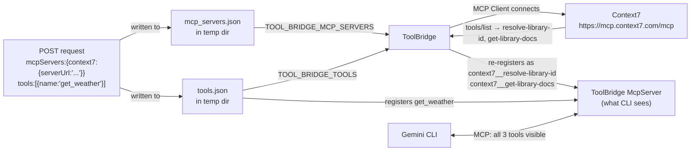
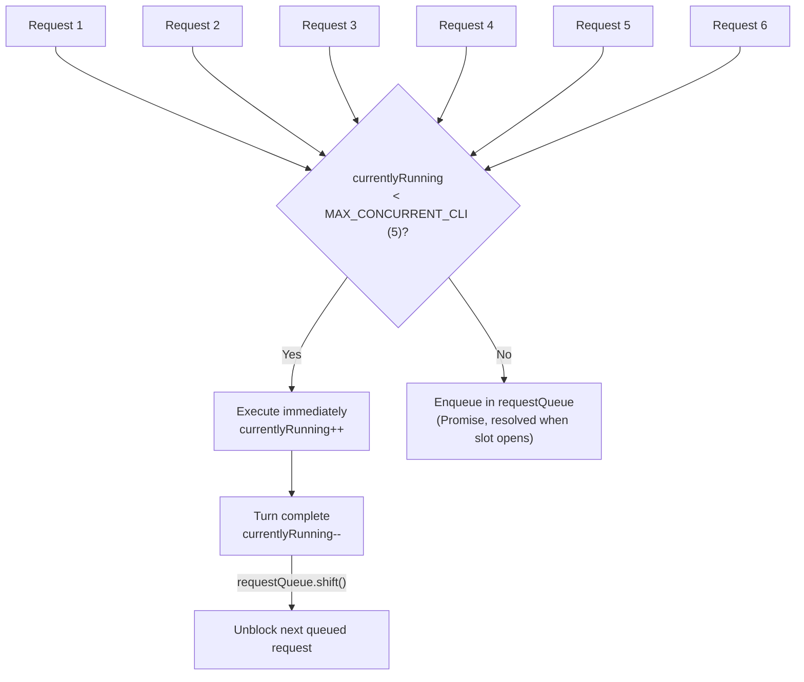
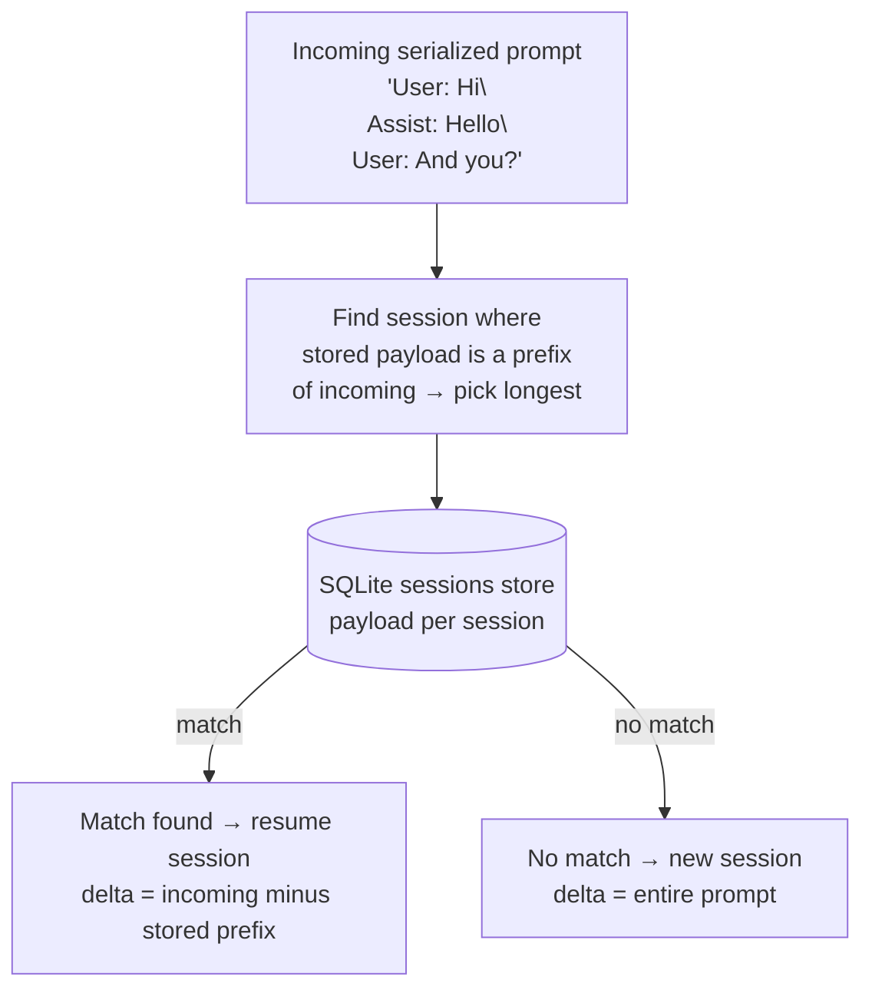

# Ionosphere Architecture

Ionosphere is a stateless HTTP bridge that translates OpenAI-compatible API requests into Gemini CLI invocations using native CLI features (JSONL streaming, MCP servers) and returns the results as OpenAI-format SSE streams. Every component lives in a single Node.js process — no persistent AI state is stored server-side.

---

## System Overview



---

## Request Lifecycle (Single Turn)



---

## Prompt Serialization

The bridge converts the OpenAI `messages` array into a plain-text prompt string that the Gemini CLI can parse. This is a strict, stateless synthesis — no previous turn state is stored server-side; the client sends the entire conversation history every request.

### Message Role Mapping

| OpenAI Role | Serialized Format |
|---|---|
| `system` | Extracted to `--system-prompt` flag content (separate from main prompt) |
| `user` | `USER: <text>` |
| `assistant` (text only) | `ASSISTANT: <text>` |
| `assistant` (with tool_calls) | `ASSISTANT: <text>\n[ACTION: Called tool '<name>' with args: <json>]` |
| `tool` / `function` | `[TOOL RESULT (<tool_call_id>)]:\n<content>` |

### Full Example

**Input (OpenAI messages)**:
```json
[
  { "role": "system", "content": "You are a helpful assistant." },
  { "role": "user",  "content": "What is the weather?" },
  { "role": "assistant", "content": "", "tool_calls": [{ "function": { "name": "get_weather", "arguments": "{\"city\":\"London\"}" } }] },
  { "role": "tool", "tool_call_id": "call_abc", "content": "Sunny, 22°C" },
  { "role": "user", "content": "Thanks!" }
]
```

**Serialized `conversationPrompt`** (sent to CLI with `-p`):
```
USER: What is the weather?

ASSISTANT:
[ACTION: Called tool 'get_weather' with args: {"city":"London"}]

[TOOL RESULT (call_abc)]:
Sunny, 22°C

USER: Thanks!
```

---

## Input Sanitization

The Gemini CLI interprets lines starting with `@` as **file injection directives** (`@/path/to/file`) and lines starting with `!` as **shell command directives** (`!ls`). To prevent user-provided text from accidentally triggering these:

```
sanitizePromptText:
  for each line in text:
    if line.startsWith('@') OR line.startsWith('!')
      prepend '\' → '\@...' or '\!...'
    else
      pass through unchanged
```

> **Important**: Only the *first character* of each line matters. An email like `user@example.com` mid-line is safe and is NOT escaped.

---

## Image and File Attachment

Ionosphere supports two attachment paths:

### Path 1 — Base64 Data URI (JSON body)



The `@` prefix at the start of a line is the CLI's native file reference syntax. The file is written to the per-turn temp directory and referenced absolutely.

### Path 2 — Multipart Form Upload



Multer routes directly into the per-turn temp directory. Files are available during the turn and garbage-collected afterward.

---

## Temporary Workspace Isolation

Each request gets a fully isolated workspace. This prevents cross-request file contamination and settings collision between concurrent requests.

```
temp/
└── {turnId-uuid}/              ← created on request arrival
    ├── .gemini/
    │   └── settings.json       ← per-turn CLI configuration
    ├── image_1.png             ← decoded base64 images
    ├── image_2.jpeg
    ├── tools.json              ← OpenAI tool definitions (if present)
    ├── mcp_servers.json        ← upstream MCP configs (if present)
    └── tool_ipc.sock           ← Unix socket for ToolBridge IPC (non-Windows)
```

A garbage collector runs every **5 minutes** and deletes any turn directory older than **15 minutes**, catching abandoned workspaces from crashed or disconnected sessions.

---

## Settings Generation (`generate_settings.js`)

For each turn, `generateConfig()` writes a fresh `settings.json` into the turn's temp `.gemini/` directory. The CLI is spawned with `--settings` pointing to this directory.

### Config Structure

```json
{
  "general": { "previewFeatures": true },
  "telemetry": { "enabled": false },
  "privacy": { "usageStatisticsEnabled": false },
  "model": {
    "name": "gemini-2.5-flash-lite",
    "maxSessionTurns": -1
  },
  "tools": {
    "exclude": [
      "list_directory", "read_file", "write_file",
      "glob", "grep_search", "replace", "run_shell_command"
    ]
  },
  "mcpServers": {
    "ionosphere-tool-bridge": {
      "command": "node",
      "args": ["/abs/path/packages/tool-bridge/index.js"],
      "env": {
        "TOOL_BRIDGE_IPC": "\\\\.\\pipe\\ionosphere-{turnId}",
        "TOOL_BRIDGE_TOOLS": "/abs/path/temp/{turnId}/tools.json",
        "TOOL_BRIDGE_MCP_SERVERS": "/abs/path/temp/{turnId}/mcp_servers.json"
      }
    }
  }
}
```

### Key Design Decisions

| Field | Value | Reason |
|---|---|---|
| `maxSessionTurns: -1` | Unlimited | Prevents CLI from silently truncating long context windows |
| `tools.exclude` | All builtins | CLI is "dumb" — it cannot read files, run commands, etc. All tools go through ToolBridge |
| `telemetry.enabled: false` | Disabled | No usage data sent to Google from bridge-invoked sessions |

### Environment Overrides

| Env Var | Effect |
|---|---|
| `GEMINI_MODEL` | Sets `model.name` |
| `GEMINI_DISABLE_TOOLS=false` | Re-enables CLI builtins (not recommended) |
| `GEMINI_DISABLE_WEB_SEARCH=true` | Also excludes `google_web_search` |
| `GEMINI_AUTH_TYPE` | Sets `auth.enforcedAuthType` |
| `SESSION_MODE=stateful` | Enables `SessionRouter` (see below) |

Custom settings from `req.body.customSettings` are deep-merged onto the base config last, allowing per-request overrides without clobbering required fields.

---

## Tool Architecture

### The "Dumb CLI" Principle

The Gemini CLI is intentionally kept as a pure reasoning engine. It cannot autonomously execute tools or reach external APIs. **Every tool call, regardless of its source, is routed back to the client.**



### OpenAI Tools Flow



### MCP Aggregation Flow

When `mcpServers` is provided in the payload, ToolBridge aggregates them:



**Key point**: The CLI only has one entry in `mcpServers` — `ionosphere-tool-bridge`. It is completely unaware of Context7 or any upstream server. All 3 tools appear identical to it.

### Tool Naming Convention

| Tool source | CLI-visible name | Example |
|---|---|---|
| OpenAI `tools[]` | `{name}` unchanged | `get_weather` |
| Upstream MCP server | `{serverName}__{toolName}` | `context7__resolve-library-id` |

Double-underscore namespacing prevents collisions when two servers expose tools with the same name.

### IPC Socket Protocol

The IPC layer uses newline-delimited JSON over a named pipe (Windows) or Unix domain socket (Linux/macOS):

**ToolBridge → Bridge** (tool call dispatch):
```json
{"event":"tool_call","name":"get_weather","arguments":{"city":"London"}}\n
```

**Bridge → ToolBridge** (client result):
```json
{"event":"tool_result","result":"Sunny, 22°C"}\n
```

Each tool call occupies exactly one socket connection. The connection is held open until the result is received (or the 10-minute timeout fires). Multiple concurrent calls use multiple simultaneous connections.

---

## CLI JSONL Output (`-o stream-json`)

The Gemini CLI streams newline-delimited JSON to stdout. The `JsonlAccumulator` in `GeminiController.js` reassembles TCP-fragmented chunks into complete lines.

### Event Types

| Event | Key Fields | Bridge action |
|---|---|---|
| `init` | `session_id`, `model` | forwarded to `onEvent` |
| `message` (user) | `role:"user"`, `content` | ignored |
| `message` (assistant) | `role:"assistant"`, `content`, `delta:true` | → `onText` → SSE `delta.content` |
| `tool_use` | `tool_name`, `tool_id`, `parameters` | → `onToolCall` → SSE `delta.tool_calls` |
| `tool_result` | `tool_id`, `status`, `output` | → `onEvent` (informational) |
| `error` | `message`, `code` | → `onError` → SSE `{error}` |
| `result` | `status`, `stats` | → `onResult` → SSE usage chunk + `[DONE]` |

> **Historical note**: Older CLI versions emitted `type:"toolCall"` (camelCase). The bridge handles both names for backward compatibility.

### Token Usage

The `result` event's `stats` block provides token counts which are surfaced in the final SSE chunk:

```json
{ "stats": { "total_tokens": 34392, "input_tokens": 32504, "output_tokens": 746, "tool_calls": 3 } }
```

→ SSE `usage: { "prompt_tokens": 32504, "completion_tokens": 746, "total_tokens": 34392 }`

---

## SSE Output Format

The bridge streams OpenAI-compatible SSE chunks. Every chunk is a `data: <json>\n\n` line.

### Text chunk
```json
{
  "id": "chatcmpl-{turnId}",
  "object": "chat.completion.chunk",
  "created": 1740000000,
  "model": "gemini-cli",
  "choices": [{ "index": 0, "delta": { "content": "Hello " } }]
}
```

### Tool call chunk
```json
{
  "id": "chatcmpl-{turnId}",
  "object": "chat.completion.chunk",
  "created": 1740000000,
  "model": "gemini-cli",
  "choices": [{
    "index": 0,
    "delta": {
      "tool_calls": [{
        "index": 0,
        "id": "call_a1b2c3d4",
        "type": "function",
        "function": { "name": "get_weather", "arguments": "{\"city\":\"London\"}" }
      }]
    },
    "finish_reason": "tool_calls"
  }]
}
```

### Final usage chunk (before `[DONE]`)
```json
{
  "id": "chatcmpl-{turnId}",
  "object": "chat.completion.chunk",
  "created": 1740000000,
  "model": "gemini-cli",
  "choices": [{ "index": 0, "delta": {}, "finish_reason": "stop" }],
  "usage": { "prompt_tokens": 32504, "completion_tokens": 746, "total_tokens": 34392 }
}
```

```
data: [DONE]
```

---

## Concurrency and Queuing



Each concurrent turn gets its own:
- `turnId` UUID
- `temp/{turnId}/` workspace
- IPC socket at `\\.\pipe\ionosphere-{turnId}` (Windows) or `temp/{turnId}/tool_ipc.sock` (Unix)
- `settings.json` in `temp/{turnId}/.gemini/`

There is zero shared state between concurrent turns.

---

## Session Modes

### Stateless (default)

Every request receives the full conversation history in `messages[]`. The bridge serializes it entirely into the `-p` prompt. No session is stored. The CLI processes the full context fresh each time.

```
Request N: USER: Hi    | ASSISTANT: Hello | USER: How are you?  → -p "USER: Hi\n\nASSISTANT: Hello\n\nUSER: How are you?"
```

### Stateful (`SESSION_MODE=stateful`)

`SessionRouter` (SQLite-backed) selects which CLI session to resume using **Longest Common Prefix (LCP)** matching:



The delta (new content only) is sent to the resumed CLI session, preserving the existing context window without re-sending history.

---

## Environment Variables Reference

| Variable | Default | Description |
|---|---|---|
| `PORT` | `3000` | HTTP server port |
| `API_KEY` | *(none)* | Bearer token validation (disabled if unset) |
| `GEMINI_CLI_PATH` | `gemini` | Path/command to invoke the Gemini CLI |
| `GEMINI_MODEL` | `gemini-2.5-flash-lite` | Model passed to CLI |
| `SESSION_MODE` | `stateless` | `stateless` \| `stateful` |
| `MAX_CONCURRENT_CLI` | `5` | Max simultaneous CLI processes |
| `GEMINI_DISABLE_TOOLS` | `true` | Set to `false` to re-enable CLI builtins |
| `GEMINI_DISABLE_WEB_SEARCH` | *(unset)* | Set to `true` to also exclude web search |
| `GEMINI_AUTH_TYPE` | *(unset)* | Forces a specific auth type in settings |
| `GEMINI_SETTINGS_JSON` | `.gemini/settings.json` | Only used by the global settings generator |

---

## Security Model

- **API key**: Simple Bearer token validation. If `API_KEY` is unset, all requests are accepted (development mode).
- **Prompt injection**: `sanitizePromptText` escapes `@` and `!` prefixes to prevent user content from triggering CLI file/shell directives.
- **Process isolation**: Each turn spawns a fresh CLI process with a scoped settings file. One turn cannot affect another's context.
- **Filesystem scope**: The CLI's builtin filesystem tools are excluded by default. Without ToolBridge, the CLI cannot read or write any files on the server.

---

## Repository Structure

```
gemini-ionosphere/
├── src/
│   ├── index.js              ← HTTP server, request handling, IPC, SSE emission
│   ├── GeminiController.js   ← CLI spawning, JsonlAccumulator, callback routing
│   ├── SessionRouter.js      ← SQLite-backed LCP session matcher
│   └── PromptDiffer.js       ← (legacy) context differ
├── packages/
│   └── tool-bridge/
│       ├── index.js          ← MCP aggregator server (ToolBridge)
│       └── package.json
├── scripts/
│   └── generate_settings.js  ← Per-turn settings.json generator
├── test/
│   ├── mock_cli.js           ← Scenario-driven mock CLI
│   ├── jsonl_accumulator.test.js
│   ├── event_router.test.js
│   ├── prompt_serial.test.js
│   ├── ipc_bridge.test.js
│   ├── settings_gen.test.js
│   ├── api_compliance.test.js
│   ├── controller.test.js
│   └── router.test.js
└── temp/                     ← Per-turn workspaces (auto-created, GC'd after 15min)
```
