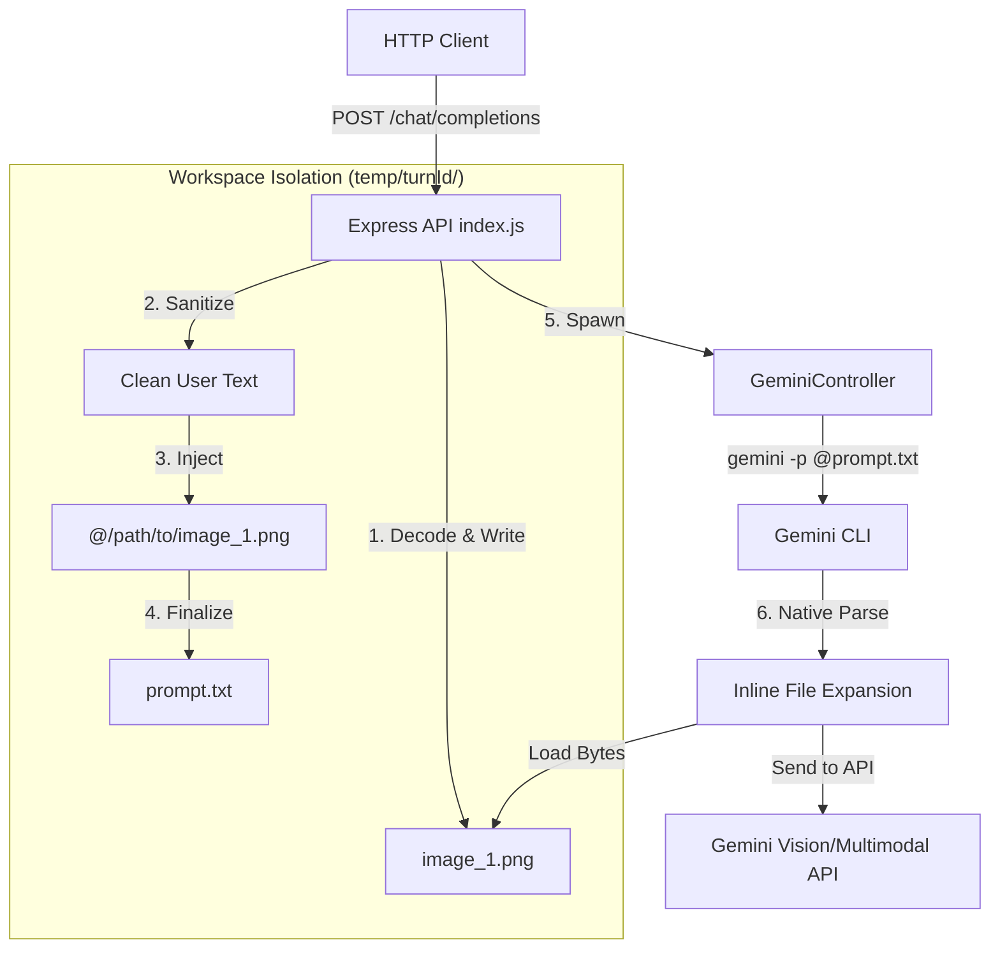
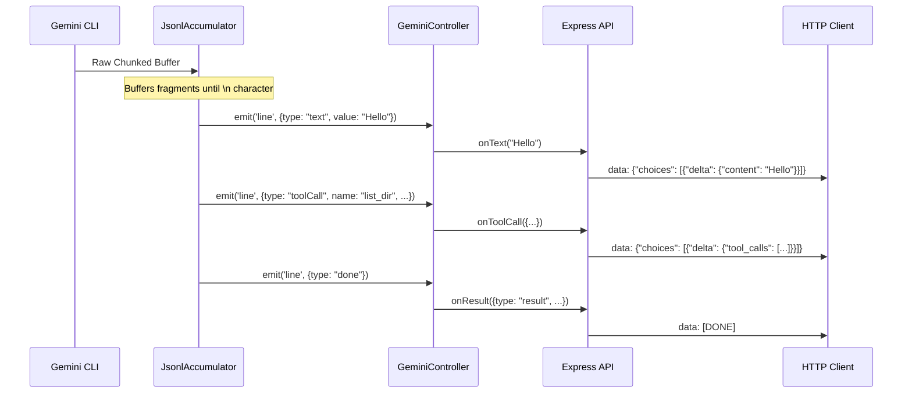

# Architecture

## Overview

Ionosphere is a configurable API bridge for the [Google Gemini CLI](https://github.com/google-gemini/gemini-cli). It operates in two modes controlled by the `SESSION_MODE` environment variable:

- **Stateless** *(default)* — Every prompt spawns a fresh `gemini -p @file -o stream-json` process. The full conversation is sent each time. No session tracking, no state drift.
- **Stateful** — Uses a **Longest Common Prefix (LCP)** algorithm to route incoming prompts to the correct Gemini CLI session via `gemini --resume <sessionId>`, sending only the new content (delta). Sessions persist across restarts.

In both modes, each prompt spawns a **one-shot CLI process** — no persistent REPL.

```
HTTP Client (Roo Code / OpenClaw / curl)
        |
        | POST /v1/chat/completions  (application/json)
        v
┌─────────────────────────────────────────────────────┐
│              Express HTTP Server (index.js)          │
│  - Infinite socket timeout                          │
│  - 15s heartbeat ping                               │
│  - Per-request event listeners                      │
│  - req.on('close') → cancelCurrentTurn()            │
└───────────────────┬─────────────────────────────────┘
                    │
                    ▼
┌─────────────────────────────────────────────────────┐
│       GeminiController (One-Shot Spawner)            │
│                                                     │
│  SESSION_MODE=stateless (default):                  │
│    Spawns: gemini -p @file -o stream-json            │
│    Full prompt every time. No session tracking.      │
│                                                     │
│  SESSION_MODE=stateful:                             │
│    SessionRouter (LCP) → { sessionId, delta }       │
│    Spawns: gemini --resume <id> -p @delta -o json   │
│    New: gemini -p @file -o stream-json              │
│    Discovers session IDs via --list-sessions        │
│                                                     │
│  - 5-minute timeout per prompt                      │
│  - JsonlAccumulator buffers OS pipe fragments       │
└───────────────────┬─────────────────────────────────┘
                    │ stdout (stream-json)
                    ▼
              Response streamed
              back to HTTP client
```

---

## The LCP Session Router (Stateful Mode Only)

> The SessionRouter is only active when `SESSION_MODE=stateful`. In stateless mode, this component is not instantiated.

Stateless AI clients (Roo Code, OpenClaw, OpenAI-compatible frontends) send the **entire conversation history** in every HTTP request. In stateful mode, Ionosphere determines **which CLI session** to resume with just the new content (the "delta").

### Algorithm

Given an incoming payload `P` and a stored session `S` with cumulative payload `S.payload`:

1. Walk character-by-character comparing `P[i]` to `S.payload[i]`
2. Stop at the first mismatch at position `n`
3. Inspect what remains at position `n`:

| `P[n]` exists? | `S[n]` exists? | Verdict |
|---|---|---|
| Yes | No | **CONTINUATION** — `S` is a prefix of `P`. Resume session S, delta = `P[n:]` |
| No | Yes | **SUBSET** — `P` is shorter than `S`. Create new session (client may branch) |
| No | No | **IDENTICAL** — exact match, no-op resume |
| Yes | Yes | **DIVERGENT** — different conversation, skip this session |

### Multi-Session Selection

When multiple sessions exist, the router picks the **non-divergent, non-subset candidate with the longest LCP**. If no valid candidates remain, a new session is created.

### Why SUBSET Creates a New Session

Consider:
```
S (stored):  "What is 2+2?" → "4" → "And what is that squared?" → "16"
P (incoming): "What is 2+2?" → "4"
```

The client sent only the first two turns. Their **next** message could be "And what is that squared?" (matching S) or "What about 3+3?" (diverging). Since we can't predict the future, we must not resume S — the CLI would carry extra context the client didn't ask for.

### Complexity

- **Time:** O(K × M) where K = stored sessions, M = payload length
- **Accuracy:** 100% — pure character comparison, no hashing
- Practically, K is small (tens of sessions) and string comparison is SIMD-optimized in V8

---

## One-Shot CLI Model

Each prompt spawns a fresh CLI process:

```bash
# Resume an existing session:
gemini --resume <sessionId> -p @prompt.txt -o stream-json

# Start a new session:
gemini -p @prompt.txt -o stream-json
```

**Why one-shot instead of persistent REPL?**

| Aspect | Persistent REPL | One-Shot |
|---|---|---|
| Multi-session support | ❌ One process = one session | ✅ Any session per prompt |
| Context persistence | ❌ Lost on crash/restart | ✅ CLI saves to disk natively |
| Cold-start overhead | None | ~1-2s per prompt |
| Process management | Complex (death detection, respawn) | Simple (spawn and wait) |

The trade-off is acceptable: the ~1-2s cold-start is negligible compared to the 5-30s LLM generation time.

---

## Session Discovery (Stateful Mode Only)

When a **new** conversation is created in stateful mode (no LCP match), the bridge must learn the session ID that the CLI assigned. After the one-shot process exits, the controller calls:

```bash
gemini --list-sessions
```

It then parses the output for the most recent UUID and registers it in the `SessionRouter` for future routing.

---

## The JSONL Accumulator

The OS pipe between Node.js and the CLI does not guarantee that a complete JSON object arrives in a single `data` event. A single object might be split across multiple reads.

`JsonlAccumulator` buffers all incoming chunks as a string. On every `\n` character it attempts to parse the preceding text as JSON. Only valid, complete JSON objects are emitted as `line` events.

---

## Signal Physics — SIGINT Survival

When an HTTP client drops mid-stream, Ionosphere dispatches `SIGINT` to the running CLI process (not `SIGTERM`). This allows the CLI to halt generation gracefully and emit a `FatalCancellationError` result, which signals the controller to clean up without losing the process.

---

## Session Persistence (Stateful Mode Only)

The `SessionRouter` uses the built-in `node:sqlite` module to continuously store session mappings (`sessionId → payload`) into `temp/sessions.db`. This means:

1. Bridge restarts reload the session map from disk
2. The CLI's own session storage (`~/.gemini/sessions/`) persists conversation history
3. Both must agree for a session to be resumable

---

## Dynamic Workspace Isolation

Every single `/v1/chat/completions` request spawns a unique, geographically isolated environment for the Gemini CLI process:

1. **Temporary Directory**: A unique `temp/<turnId>/` folder is scaffolded on the host.
2. **File Sandboxing**: To attach files or URLs to a prompt, clients pass them as inline text references in their message content (e.g., `"Summarize this file: @/path/to/doc.pdf"`). Note that the orchestrator requires absolute paths.
3. **Dynamic Configuration**: Ionosphere writes a bespoke `.gemini/settings.json` file inside `temp/<turnId>/`. This file inherits the baseline system settings but merges in request-specific properties, such as dynamically defined MCP Servers.
4. **Execution**: The `gemini` one-shot process is spawned with `cwd` set to the isolated folder and `GEMINI_SETTINGS_JSON` pointing to the bespoke snapshot.
5. **Collection**: Once the streaming turn completes or aborts, the entire `temp/<turnId>/` tree is recursively deleted.

This architecture ensures zero cross-pollination between concurrent requests, limits the blast radius of any file operations, and enables multi-tenant tool configurations without race conditions.

---

---

## Multimodal Input Handling (Vision & Files)

Ionosphere handles multimodal inputs (images, PDFs, etc.) by leveraging the Gemini CLI's native **inline file expansion**. Instead of passing files as separate command-line arguments, they are injected directly into the text prompt.

### Data Flow



### Sanitization & Safety

To prevent prompt injection or accidental file loading from user-provided text:
1.  **Upstream Sanitization**: All user-provided text is sanitized *before* machine-generated paths are added. Any line starting with `@` or `!` is escaped with a backslash (`\@`).
2.  **Machine Injection**: The orchestrator then prepends the absolute paths of verified uploaded files as clean `@/path` lines.
3.  **Bypass**: Because the machine-generated lines are added *after* the sanitization step, they remain un-escaped, allowing the CLI to recognize them.

---

---

## The Assembly Line: Reconstructing the Context

When an API request arrives, Ionosphere assembles a unified execution context for the one-shot CLI spawn. This is how the various parts come together:

### 1. The Prompt Snapshot (`prompt.txt`)
The `index.js` message loop iterates through the entire conversation history to build a single text payload:
*   **System Messages**: Aggregated and written to `system.md` (overriding `GEMINI_SYSTEM_MD`).
*   **User/Assistant Text**: Sanitized (escaping `@` and `!`) and prepended with machine-generated file references.
*   **Image Attachments**: Decoded from base64 into `image_N.png` and injected as `@/path/to/image_N.png` lines directly inside the message block.
*   **File Attachments**: For multipart uploads, the absolute path is prepended to the final prompt as `@/path/to/file`.
*   **Action Narration**: Assistant tool calls are explicitly narrated (e.g., `[ACTION: Called tool 'foo' with args: {...}]`) and tool results are labeled (e.g., `[TOOL RESULT (foo)]: ...`) to maintain ReAct loop context in the one-shot history.

### 2. Configuration Snapshot (`settings.json`)
The `scripts/generate_settings.js` logic creates a bespoke configuration for the turn:
*   **MCP Servers**: If provided in the request, they are merged into the `mcpServers` block.
*   **Tool Constraints**: Dangerous tools are disabled, while necessary tools (like `read_many_files`) are enabled.
*   **Model Routing**: If a specific `model` is requested, it is mapped to a custom alias in the settings to override the default.

---

## Output Emission: From JSONL to SSE

The Gemini CLI emits a stream of JSON objects to `stdout`. The bridge transforms these into OpenAI-compatible Server-Sent Events (SSE).

### Data Transformation Flow



### Key Mechanisms
*   **JsonlAccumulator**: Crucial for OS pipe stability. It ensures that even if a large JSON object (like a long tool call) is fragmented across multiple 64KB pipe chunks, it is correctly reconstructed before being parsed.
*   **15s Heartbeat**: While waiting for complex ReAct loops or slow tool executions, the API sends `: ping` comments to keep the HTTP socket alive and prevent timeouts.
*   **SIGINT Handling**: If the client disconnects, `SIGINT` is sent to the CLI, causing it to halt and emit a final `FatalCancellationError` JSON, allowing the bridge to clean up the workspace immediately.

---

## Tool Integration

Ionosphere leverages the Gemini CLI's built-in tool execution capabilities.

### Built-in Tools
It heavily restricts which tools are available to prevent unintended side effects on the host system.
- **Disabled Tools**: By default, the `generate_settings.js` script explicitly disables dangerous tools. The disabled list includes: `list_directory`, `read_file`, `write_file`, `glob`, `grep_search`, `replace`, and `run_shell_command`. 
- **Enabled Tools**: `read_many_files` is always enabled for large context reads. `google_web_search` can be optionally enabled during startup.

### MCP Servers (Model Context Protocol)

Because Ionosphere employs **Dynamic Workspace Isolation** (see above), clients can inject custom MCP Server configurations directly into the API request on a turn-by-turn basis.

By including an `"mcpServers": {}` block in the JSON body of the `/v1/chat/completions` HTTP request, Ionosphere parses the payload and natively merges it into the `.gemini/settings.json` file just before the process spawns. The Gemini CLI then organically connects to those MCP servers for that specific reasoning loop.

```json
{
  "messages": [{"role": "user", "content": "Ask context7 about LSMCP"}],
  "mcpServers": {
    "context7": {
      "httpUrl": "https://mcp.context7.com/mcp",
      "headers": {
        "Accept": "application/json, text/event-stream"
      }
    }
  }
}
```

Since the isolated `.gemini/settings.json` file is destroyed at the end of the turn, subsequent API requests are unpolluted.

---

## Docker Build

The deployment is a lightweight, single-stage `node:22-slim` container.

It installs standard Node dependencies, then installs the `@google/gemini-cli` globally so the binary is baked into the image at build time.

The `GEMINI_CLI_TAG` build arg (default: `latest`) controls which release channel of the CLI is installed:

```bash
docker-compose build --build-arg GEMINI_CLI_TAG=preview
```

The container's `CMD` generates `settings.json` at startup then launches the orchestrator:

```dockerfile
CMD ["sh", "-c", "node scripts/generate_settings.js && node src/index.js"]
```
