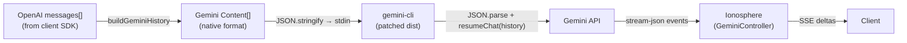

# Native History Protocol

The Native History Protocol replaces the text-flattening approach for prompt
serialization with a direct **Gemini Content[]** JSON pipeline. This preserves
structured data (images, function calls, function responses) losslessly across
turns.

---

## Motivation

The original prompt serialization (see `ARCHITECTURE.md § Prompt Serialization`)
converts OpenAI `messages[]` into plain text with markers like
`ASSISTANT:`, `[ACTION: ...]`, and `[TOOL RESULT (...)]`. This approach:

- **Destroys structured data**: Images become file paths, JSON becomes stringified text
- **Loses type fidelity**: `functionCall` / `functionResponse` parts become regex-parseable text
- **Breaks chronology**: Multi-part turns (text + tool calls) must be reconstructed

The Native History Protocol eliminates these issues by translating directly
between OpenAI's `messages[]` and Gemini's `Content[]` formats.

---

## Architecture



### Data Flow

1. Client sends standard OpenAI `messages[]` via `POST /v1/chat/completions`
2. **`buildGeminiHistory(messages)`** translates to Gemini `Content[]`
3. The JSON array is piped to `gemini-cli` via **stdin**
4. The patched CLI parses the JSON, seeds history via `resumeChat()`, and sends the last entry as the current query
5. Response streams back as `stream-json` events → SSE deltas

---

## Format Translation

### `buildGeminiHistory(messages)` — OpenAI → Gemini Mapping

| OpenAI Role                   | Gemini Role | Parts                                                 |
| ----------------------------- | ----------- | ----------------------------------------------------- |
| `user` (text)                 | `user`      | `[{ text: "..." }]`                                   |
| `user` (image, data URI)      | `user`      | `[{ inlineData: { mimeType, data } }]`                |
| `user` (image, URL)           | `user`      | `[{ text: "[Image: url]" }]`                          |
| `assistant` (text only)       | `model`     | `[{ text: "..." }]`                                   |
| `assistant` (with tool_calls) | `model`     | `[{ text: "..." }, { functionCall: { name, args } }]` |
| `tool` / `function`           | `user`      | `[{ functionResponse: { name, response } }]`          |
| `system`                      | _(skipped)_ | Passed separately as system instruction               |

### Example

**OpenAI Input:**

```json
[
  { "role": "user", "content": "What's the weather?" },
  {
    "role": "assistant",
    "content": "Let me check.",
    "tool_calls": [
      {
        "id": "call_1",
        "function": { "name": "get_weather", "arguments": "{\"city\":\"SF\"}" }
      }
    ]
  },
  {
    "role": "tool",
    "tool_call_id": "call_1",
    "name": "get_weather",
    "content": "{\"temp\":72}"
  },
  { "role": "user", "content": "Thanks!" }
]
```

**Gemini Output:**

```json
[
  { "role": "user", "parts": [{ "text": "What's the weather?" }] },
  {
    "role": "model",
    "parts": [
      { "text": "Let me check." },
      { "functionCall": { "name": "get_weather", "args": { "city": "SF" } } }
    ]
  },
  {
    "role": "user",
    "parts": [
      {
        "functionResponse": {
          "name": "get_weather",
          "response": { "temp": 72 }
        }
      }
    ]
  },
  { "role": "user", "parts": [{ "text": "Thanks!" }] }
]
```

---

## Activation

The protocol is controlled by the **`IONOSPHERE_STRUCTURED_HISTORY`** environment variable, set automatically by the bridge when spawning CLI processes.

| Component                              | Mechanism                                                     |
| -------------------------------------- | ------------------------------------------------------------- |
| **Bridge** (`index.js`)                | Sets `IONOSPHERE_STRUCTURED_HISTORY=true` in `sendPrompt` env |
| **Controller** (`GeminiController.js`) | Receives `structuredContents`, pipes JSON to stdin            |
| **CLI** (`nonInteractiveCli.js`)       | Patched by `patch-gemini-core.js` to detect env var           |

### Patcher

Section 3 of `scripts/patch-gemini-core.js` patches the compiled
`nonInteractiveCli.js` dist in `node_modules`. It replaces the init → query
block with a dual-path version:

- **Structured path** (env var set): Parse stdin as `Content[]`, call
  `resumeChat(history)`, use last entry as query
- **Standard path** (env var unset): Original text mode with slash commands
  and `@` includes

The patch is idempotent — safe to run multiple times.

---

## Files Modified

| File                           | Description                                                                   |
| ------------------------------ | ----------------------------------------------------------------------------- |
| `src/index.js`                 | `buildGeminiHistory()` function + `sendPrompt` call with `structuredContents` |
| `src/GeminiController.js`      | `structuredContents` parameter, conditional JSON stdin piping                 |
| `scripts/patch-gemini-core.js` | Section 3: patches compiled `nonInteractiveCli.js` dist                       |

---

## Fallback Behavior

If structured history parsing fails (malformed JSON, empty array), the patched
CLI falls through to standard text mode. The bridge always sends `promptText`
as the second argument to `sendPrompt` as a fallback.

---

## Relationship to Existing Architecture

This protocol **coexists** with the existing prompt serialization. The text
prompt (`promptText`) is still constructed and passed as a fallback. The
structured history is an **additional** data path that takes priority when the
env var is set.

The Warm Stateless Handoff strategy (parking, hijacking) is **unchanged** —
it operates at the HTTP/IPC layer, orthogonal to how the prompt is serialized.
